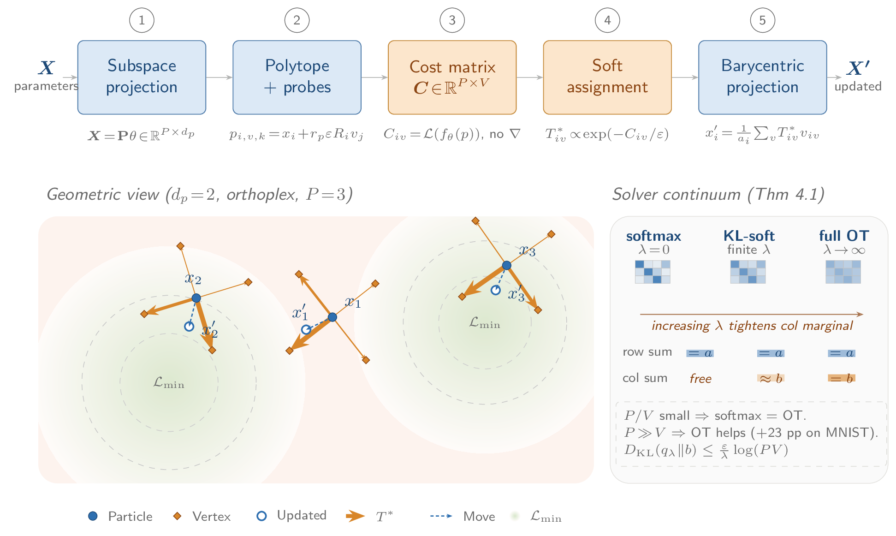
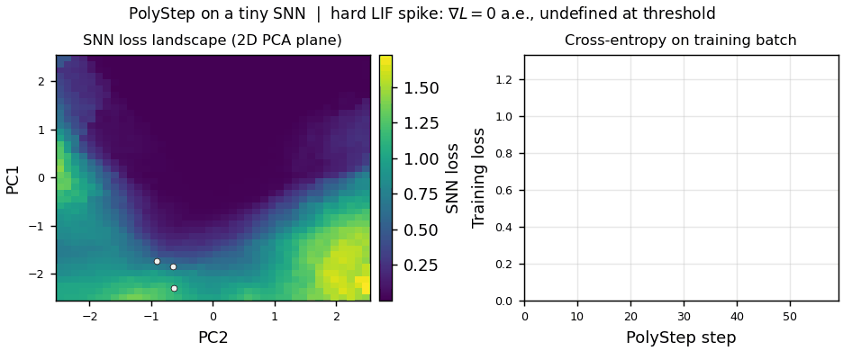
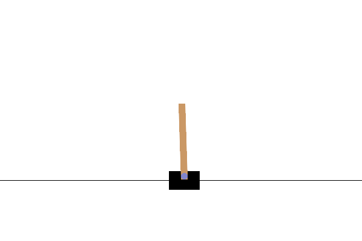

# polystep

[](https://arxiv.org/abs/2605.01928)
[](https://www.python.org/downloads/)
[](https://pytorch.org/)
[](LICENSE)

**Gradient-free neural network training via optimal transport.**

PolyStep optimizes neural networks without backpropagation. At each step, it samples polytope vertices around current parameters, evaluates losses via forward passes only, and computes softmax-weighted projections to find descent directions. This enables training models with non-differentiable components (spiking networks, quantized layers, blackbox modules) where gradients are unavailable or undefined.

Based on the Sinkhorn Step algorithm ([Le et al., NeurIPS 2023](https://arxiv.org/abs/2309.15970)), extended with subspace compression, a softmax solver, and convergence analysis for piecewise-smooth losses.

### How it works

1. **Sample** polytope vertices around the current parameters in a compressed subspace.
2. **Evaluate** the loss at each vertex (forward pass only, no gradients).
3. **Compute** softmax weights over the cost matrix.
4. **Update** the parameters by barycentric projection from the weighted vertices.

<p align="center">
  
</p>

> Want to play around with parameters? [**Viet T. Nguyen**](https://vietngth.github.io/) built a gorgeous interactive walkthrough that animates every step of the method -> **[explore the PolyStep visualization](https://vietngth.github.io/polystep-visualization/)**.

## Installation

```bash
pip install -e .                      # core library (torch + numpy)
pip install -e ".[examples]"          # + torchvision, matplotlib
pip install -e ".[dev]"               # + pytest, ruff (development)
pip install -e ".[experiments]"       # + scipy, pandas, python-sat (paper reproduction)
```

GPU: `pip install torch --index-url https://download.pytorch.org/whl/cu130` (or pick the CUDA build that matches your driver from the [PyTorch install page](https://pytorch.org/get-started/locally/)).

## Quickstart

### Synthetic optimization

```python
import torch
from polystep import PolyStep, Ackley

solver = PolyStep.create(Ackley(dim=10), epsilon=0.5, max_iterations=50)
state = solver.run(torch.randn(100, 10))
print(f"Best cost: {min(state.costs):.4f}")
```

### Neural network training

```python
import torch
import torch.nn as nn
from torch.utils.data import DataLoader, TensorDataset

from polystep import PolyStepOptimizer, train, TrainConfig
from polystep.epsilon import CosineEpsilon
from polystep.hybrid_subspace import HybridSubspace
from polystep.transform import ParamLayout

model = nn.Sequential(nn.Linear(784, 128), nn.ReLU(), nn.Linear(128, 10))

# Replace this with your real DataLoader.
train_loader = DataLoader(
    TensorDataset(torch.randn(1024, 784), torch.randint(0, 10, (1024,))),
    batch_size=64,
)

# HybridSubspace compresses the parameter space per-layer.
layout = ParamLayout.from_module(model)
subspace = HybridSubspace.from_layout(layout, rank=8)

# Cosine schedules: broad exploration -> fine exploitation.
optimizer = PolyStepOptimizer(
    model, subspace=subspace, solver="softmax",
    epsilon=CosineEpsilon(init=10.0, target=0.1, decay=0.02),
    step_radius=CosineEpsilon(init=5.0, target=1.0, decay=0.008),
    probe_radius=CosineEpsilon(init=10.0, target=2.0, decay=0.016),
)

train(model, train_loader, nn.CrossEntropyLoss(), optimizer, TrainConfig(epochs=5))
```

### Drop-in gradient-free optimizer (ask/tell)

PolyStep also exposes the `ask`/`tell` interface used by evolution-strategy libraries, so it drops into ES benchmark harnesses (evosax, NeuroEvoBench) and any black-box loop:

```python
import torch
from polystep import PolyStepES

es = PolyStepES(dim=20, epsilon=0.1, step_radius=0.3, x0=torch.full((20,), 2.0))
for _ in range(300):
    candidates = es.ask()           # (popsize, dim) points to evaluate
    es.tell(objective(candidates))  # lower fitness is better
print(es.best_fitness, es.mean)
```

[`experiments/bench_ask_tell.py`](experiments/bench_ask_tell.py) compares it head-to-head with a Gaussian ES on the standard synthetic suite under a matched evaluation budget.

See [`examples/`](examples/) for runnable demos covering SNN, RL, MAX-SAT, MNIST, a Loihi 2 on-chip adaptation skeleton, STE-free binary-net training vs OpenAI-ES, direct F1 minimization where PolyStep beats both a biased gradient (Adam+STE) and OpenAI-ES, and a hard oblique decision tree with strict argmax routing that PolyStep trains directly while OpenAI-ES and SPSA stall.

<table>
  <tr>
    <td align="center"><br><sub>Spiking net (hard LIF thresholds) trained with forward passes only</sub></td>
    <td align="center"><br><sub>CartPole policy search: no value function, no gradients</sub></td>
  </tr>
</table>

## When to use PolyStep

PolyStep is designed for models where gradients are **unavailable or unreliable**:

- **Spiking neural networks**: hard LIF thresholds, discrete spike events
- **Quantized layers**: int8 weights, binary/ternary networks
- **Blackbox modules**: external simulators, API-based models, hardware-in-the-loop
- **Hard routing**: argmax gating, hard mixture-of-experts
- **Combinatorial optimization**: MAX-SAT, discrete assignment problems

If your model is fully differentiable, Adam/SGD will be faster and more accurate.

## How PolyStep relates to other gradient-free methods

Zeroth-order optimization splits into two camps. Memory-efficient fine-tuning (MeZO and successors) runs zeroth-order updates on differentiable networks to skip the backprop tape, but still assumes a useful local gradient. Evolution strategies and SPSA (CMA-ES, OpenAI-ES) optimize black-box objectives by estimating a local gradient from small perturbations.

PolyStep is a randomized direct search: it probes a finite-radius polytope around the current parameters and moves toward the lowest-cost vertices through an optimal-transport barycenter. When the loss is piecewise-constant or genuinely non-differentiable, the local gradient is zero almost everywhere, so finite-difference estimates carry no signal and ES/SPSA stall, while a finite radius steps across the flat regions. This is the setting where direct search (generalized pattern search, MADS) has convergence guarantees on nonsmooth and discontinuous objectives that gradient-estimate methods lack. Example 09 shows the separation on a hard decision tree.

Recent gradient-free work targets the same regime, including low-rank evolution strategies for spiking networks (arXiv:2605.30361) and gradient-free trust regions for recurrent spiking networks (arXiv:2601.21572). PolyStep is complementary: a general-purpose direct-search optimizer with subspace compression.

## Benchmarks

5-seed mean ± std (seeds: 42, 123, 456, 789, 1337). Hardware: NVIDIA RTX 5090.

### Non-differentiable tasks

Best accuracy (%), 5 seeds. Bold marks the best method on each row. Adam is gradient-based (backprop on a smoothed surrogate), so it is an unfair reference upper bound, not a gradient-free peer of PolyStep, CMA-ES, OpenAI-ES, and SPSA; it is shown only to bound how far the gradient-free methods sit from a gradient method. A dash means the run is not in this release.

| Task | PolyStep | Adam (surrogate) | CMA-ES | OpenAI-ES | SPSA | Non-diff op |
|------|----------|------------------|--------|-----------|------|-------------|
| SNN/LIF (MNIST) | **93.4 ± 0.2** | 80.5 | 16.2 | 33.1 | 29.4 | threshold() |
| Int8 quantized | 97.1 ± 0.1 | **98.1** | 80.7 | 78.1 | 91.2 | round() |
| Argmax attention | 86.8 ± 0.4 | **89.1** | 72.6 | 75.7 | 77.7 | argmax() |
| Staircase activation | 93.2 ± 0.3 | **97.6** | 72.8 | 85.5 | 49.3 | floor() |
| Hard MoE routing | **90.7 ± 0.2** | - | 62.8 | 63.5 | 69.3 | argmax() |
| MAX-SAT 100K vars | **98.0 ± 0.01** | - | 90.1 | 88.9 | - | round() |
| MAX-SAT 1M vars | **92.6 ± 0.02** | - | - | 87.8 | - | round() |

### Differentiable sanity checks

Adam here is gradient-based (backprop), an unfair reference rather than a peer; PolyStep stays gradient-free and forward-only. These rows only check that PolyStep lands close to a gradient method when gradients do exist.

| Task | PolyStep | Adam | Architecture |
|------|---------|------|--------------|
| MNIST | **96.0% ± 0.1** | 97.9% | 2-layer MLP (101K) |
| ETTh1 timeseries | **MSE 0.121 ± 0.004** | MSE 0.187 | LSTM (23K) |

### SNN memory scaling (forward-only vs. BPTT)

| Timesteps | PolyStep | BPTT (surrogate) | Savings |
|-----------|---------|------------------|---------|
| T=25 | 31.8 MB | 132 MB | 4.2x |
| T=400 | 51.6 MB | 1,538 MB | **29.8x** |

Among gradient-free optimizers PolyStep is the strongest on every task here, at 100 to 10,000x more evaluations than the ES and SPSA baselines. Against the gradient surrogate, PolyStep wins where the non-differentiability is hard (SNN hard LIF, hard MoE routing) and loses where an accurate smooth surrogate exists (int8, argmax, staircase), so its niche is hard non-differentiability rather than non-differentiability in general. On MAX-SAT the domain-specialized probSAT and WalkSAT-style SLS solvers beat every general optimizer (probSAT reaches about 99.6% at 100K variables and 98.9% at 1M); PolyStep is the strongest general-purpose gradient-free method here, not a replacement for a domain solver.

## Features

- **Softmax OT solver** with an entropic Sinkhorn alternative.
- **Subspace compression**: `HybridSubspace` (recommended), `AdaptiveSubspace`, and sparse projection for very large models.
- **Block-wise OT** for per-layer decomposition.
- **`torch.compile`** opt-in on hot paths.
- **Vmap-safe layers**: drop-in attention and LSTM that play nicely with `torch.vmap`.
- **Sub-linear memory**: forward-only evaluation, no BPTT activation tape (~30x savings at long SNN horizons).
- **CMA-ES inspired adaptation** of subspace covariance (experimental, monolithic step only; `use_adaptive_radius` is the stable default).
- **MLP fast path** using batched `torch.bmm` instead of vmap for pure-MLP `nn.Sequential` models.
- **Ask/tell API**: `PolyStepES` drops into evosax / NeuroEvoBench-style ES harnesses and black-box loops.

## Limitations

- **Compute cost.** Roughly tens of millions of forward passes (on the SNN benchmark, around 30M) vs. tens of thousands of Adam gradient steps for the same MNIST accuracy. This is inherent to zeroth-order methods.
- **High-dimensional NLP.** Near-random accuracy on SST-2 (4.2M parameters trained from scratch). Gradient-free methods do not scale to this regime in our experiments.
- **Adam baseline.** On a smoothed surrogate, Adam beats PolyStep on int8 (98.1 vs 97.1), argmax (89.1 vs 86.8), and staircase (97.6 vs 93.2), and only loses where the non-differentiability is hard (SNN hard LIF 93.4 vs 80.5; hard MoE routing). The stronger surrogate-gradient / BPTT baseline for SNNs (paper §5.3) is not bundled with this release; see the arXiv preprint.

See [`LIMITATIONS.md`](LIMITATIONS.md) for the full discussion.

## Project structure

```
src/polystep/          Core library (optimizer, solvers, subspaces, geometry)
tests/                 Unit, integration, and regression tests
examples/              8 runnable demos (quickstart, SNN, RL, MAX-SAT, MNIST, Loihi 2, STE-free binary net, direct loss minimization)
experiments/           Paper reproduction: runners, results, baselines
docs/                  API overview, reproducibility guide
```

## Documentation

| Resource | Description |
|----------|-------------|
| [`examples/`](examples/) | 8 runnable demos with output figures |
| [`experiments/`](experiments/) | Full paper reproduction harness |
| [`docs/api_overview.md`](docs/api_overview.md) | API reference |
| [`LIMITATIONS.md`](LIMITATIONS.md) | Known limitations |
| [`CONTRIBUTING.md`](CONTRIBUTING.md) | Contribution guidelines |
| [`CHANGELOG.md`](CHANGELOG.md) | Release history |

## Citation

If you find this work useful, please consider citing:

```bibtex
@article{le2026training,
  title={Training Non-Differentiable Networks via Optimal Transport},
  author={Le, An T},
  journal={arXiv preprint arXiv:2605.01928},
  year={2026}
}
```

## Acknowledgments

A huge thank you to [**Viet**](https://vietngth.github.io/) for building a beautiful interactive [PolyStep visualization](https://vietngth.github.io/polystep-visualization/), it brings the method to life and makes every step click!

## License

Apache License 2.0. See [LICENSE](LICENSE).
